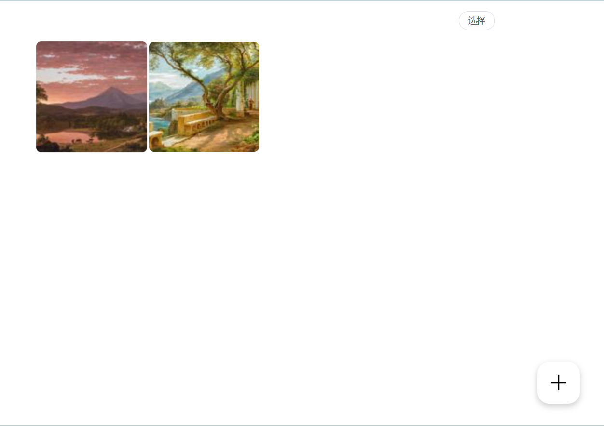
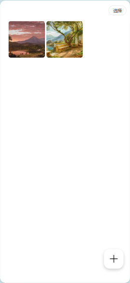
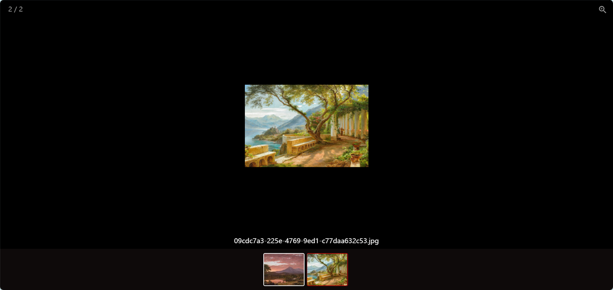

# Slor

**其他语言版本: [English](README_EN.md).**

本项目名为Slor,主要用于展示家人的照片和视频，伴随时间轴的变化，照片和视频也随之展示。

适配浏览器，支持PC和移动端。

### 预览





### 前端
    
前端使用vue3和element plus，展示瀑布流照片和视频，具有添加、批量删除、预览功能。

### 后端

后端使用flask和uv包管理器。生成照片和视频的缩略图，并生成JSON数据结构。


### 部署
1. 更换app.py中`VALID_PASSWORD`，`server_addr`

1. 更换`./SlorUI/vite.config.ts`中`target`
    ```
    target=server_addr
    ```

1. 构建`dist`文件夹
    ```
    cd SlorUI
    npm run build
    ```

1. 移动`SlorUI/dist/index.html`到`templates`文件夹下  

1. 移动`SlorUI/dist/assets`到`static`文件夹下  

1. 安装uv
    ```
    # use administrator powershell
    powershell -c "irm https://astral.sh/uv/install.ps1 | iex"
    set Path=C:\Users\abin\.local\bin;%Path%

    # linux
    curl -LsSf https://astral.sh/uv/install.sh | sh


    # 或者
    pip install uv
    ```
1. 运行server
    ```
    uv run app.py
    ```

1. 持久化运行server
    ```
    uv tool install gunicorn
    uv run gunicorn -D -w 4 -b 127.0.0.1:5000 app:app
    ```
