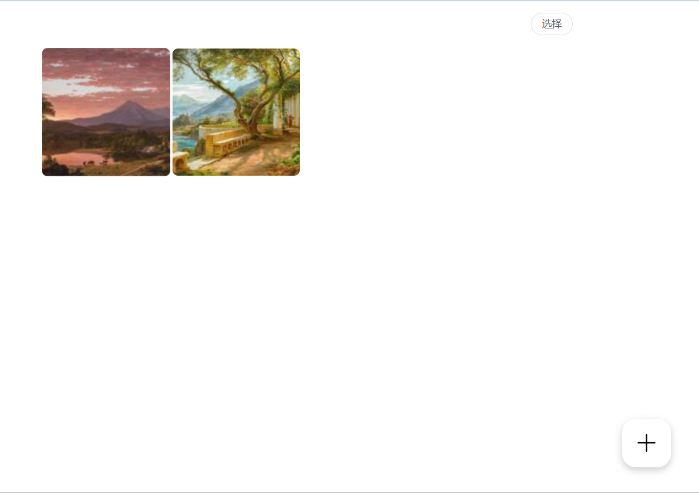
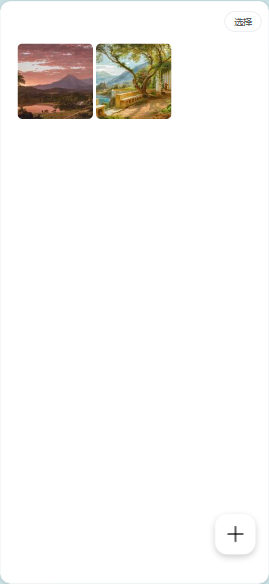

# Slor

The project is named Slor and is mainly used to display photos and videos of family members. As the timeline changes, photos and videos are also displayed.

### Preview




### Frontend
    
The front-end is pure HTML code, using Vue and Element Plus to display waterfall photos and videos in a timeline, with preview, add, and batch delete functions.

### Backend

The backend uses Flask and UV package managers. Generate thumbnail images of photos and videos, and generate JSON data structures.


### Deployment
1. Replace`VALID-PASSWORD` in app.py
1. Install UV
    ```
    pip install uv
    ```
1. Run
    ```
    uv run app.py
    ```
1. Persistent operation
    ```
    uv tool install gunicorn
    uv run gunicorn -D -w 4 -b 127.0.0.1:11110 app:app
    ```