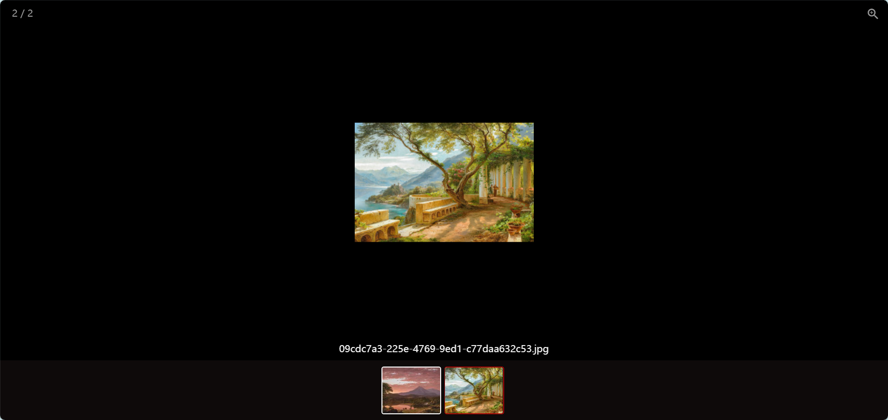

**Other language versions: [Chinese](README_EN.md).**

The project is named Slor and is mainly used to display photos and videos of family members. As the timeline changes, photos and videos are also displayed accordingly.

Compatible with browsers, supporting both PC and mobile devices.

### Preview




### Frontend
    
The front-end uses Vue3 and Element Plus to display waterfall photos and videos, with functions such as adding, batch deleting, and previewing.

### Backend

The backend uses Flask and UV package managers. Generate thumbnail images of photos and videos, and generate JSON data structures.


### Deployment
1. Replace the 'VALID-PASSWORD' in app. py` server_addr`

1. Replace/ Target in SlorUI/cite. config. ts`
```
target=server_addr
```

1. Install UV
```
# use administrator powershell
powershell -c "irm  https://astral.sh/uv/install.ps1  | iex"
set Path=C:\Users\abin\.local\bin;% Path%
perhaps
pip install uv
```
1. Run the server
```
uv run app.py
```
1. Run the client
```
npm run dev
```

1. Persistently run the server
```
uv tool install gunicorn
uv run gunicorn -D -w 4 -b 127.0.0.1:5000 app:app
```
